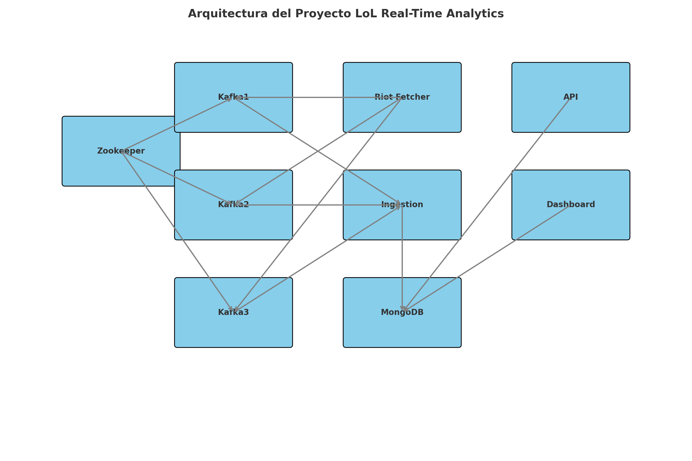

# TFM - Análisis en Tiempo Real de Partidas de Videojuegos Competitivos

Plataforma de análisis en tiempo real de partidas de **League of Legends**, diseñada como parte del Trabajo de Fin de Máster en Ingeniería de Datos.  
La arquitectura combina **procesamiento en streaming**, **almacenamiento NoSQL** y un **dashboard interactivo**, permitiendo consultar estadísticas actualizadas de las partidas mientras suceden.

---

## 🎯 Objetivo

Desarrollar una plataforma capaz de:
- Ingerir datos en tiempo real desde la API de Riot Games (League of Legends).
- Procesar los eventos con Spark Streaming.
- Detectar eventos tácticos relevantes (snowballs, comebacks...).
- Visualizar estadísticas y análisis contextual en un dashboard interactivo.
- Integrar lógica basada en reglas y modelos ligeros de ML.

---

## 🧱 Arquitectura



**Componentes principales:**
- **Zookeeper**: Coordinación de los brokers Kafka.
- **Kafka Cluster (3 brokers)**: Ingesta y distribución de eventos en tiempo real.
- **MongoDB**: Almacenamiento NoSQL para datos procesados.
- **API**: Servicio REST para exponer datos a terceros.
- **Riot Fetcher**: Obtención de datos desde la API oficial de Riot Games.
- **Ingestion**: Procesamiento y transformación de datos.
- **Dashboard**: Interfaz gráfica con métricas y visualizaciones en Streamlit.

---

## 🚀 Tecnologías utilizadas

| Tecnología     | Uso                                |
|----------------|-----------------------------------|
| **Docker**     | Contenedorización y orquestación  |
| **Kafka**      | Streaming de datos                |
| **Zookeeper**  | Coordinación de Kafka             |
| **MongoDB**    | Base de datos NoSQL               |
| **Python**     | Servicios backend y procesadores  |
| **Streamlit**  | Dashboard interactivo             |
| **FastAPI**    | Exposición de datos vía API REST  

--- 

## 📁 Estructura
```plaintext
├── app/
│ ├── api/ # Servicio FastAPI
│ ├── dashboard/ # Dashboard en Streamlit
│ ├── ingestion/ # Procesamiento de datos
│ └── riot_fetcher/ # Conexión con la API de Riot Games
├── data/ # Datos persistentes (MongoDB, Kafka)
├── connect
├── output
├── src/
│ ├── api/ 
│ ├── dashboard/ 
│ ├── ingestion/ 
│ └── riot_fetcher/
├── .env 
├── docs/ # Diagramas y documentación
├── init-topics.sh # Script para inicializar tópicos Kafka
├── docker-compose.yml # Orquestación de contenedores
├── Makefile # Comandos simplificados para levantar el entorno
└── README.md # Este archivo
```
---

## 🛠 Requisitos

```bash
pip install -r requirements.txt

### 🔐 Configuración de clave API

Este proyecto requiere una clave válida de Riot Games.  
Por seguridad, esta clave no está incluida en el repositorio.

Antes de ejecutar los scripts, crea un archivo:

```plaintext
shared/onfig.py
```

con el siguiente contenido:

```python
RIOT_API_KEY = "tu_clave_aquí"
```

Este archivo está ignorado en `.gitignore` y debe crearse manualmente en cada entorno.
💡 Puedes usar como plantilla el archivo de ejemplo:

```plaintext
shared/config_example.py
```

## ⚡ Comandos Rápidos

Antes de empezar, asegúrate de tener Docker y Make instalados.  
En Windows puedes instalar `make` con:
```bash
winget install GnuWin32.Make
```

Levantar todos los servicios
```bash
make up
```

Ver logs
```bash
make logs
```

Apagar servicios
```bash
make down
```

Reiniciar todo y reconstruir imágenes
```bash
make reset
```

Verificar contenedores en ejectución
```bash
make ps
```

Re-crear tópicos Kafka
```bash
make recreate-topics
```

---

## 🚀 Cómo ejecutar el proyecto

1. **Clonar el repositorio**
   ```bash
   git clone https://github.com/laurasc14/TFM-LoL-RealTime-Analytics.git
   cd TFM-LoL-RealTime-Analytics
   ```
2. **Levantar la infraestructura**
    ```bash
   make up
   ```
3. (Opcional) Incializar tópicos Kafka
    ```bash
   make init-topics
   ```
4. Detener entorno
    ```bash
   make down
   ```

---

## 🔧 Comandos útiles
**Crear un nuevo tópico:**
   ```bash
   docker exec -it kafka1 kafka-topics.sh --create --topic <nombre> --partitions 3 --replication-factor 3 --bootstrap-server kafka1:9092
   ```
**Probar productor/consumidor:**
   ```bash
   docker exec -it kafka1 kafka-console-producer.sh --broker-list kafka1:9092 --topic test
   docker exec -it kafka1 kafka-console-consumer.sh --bootstrap-server kafka1:9092 --topic test --from-beginning
   ```

---

## 📊 Tópicos Kafka

| Tópico        | Particiones | Replicación | Retención |
| ------------- | ----------- | ----------- | --------- |
| `lol-matches` | 6           | 3           | 7 días    |
| `lol-players` | 6           | 3           | 7 días    |
| `lol-events`  | 6           | 3           | 3 días    |

---

## 🔮 Próximos pasos

- Implementar autenticación y seguridad en la API.
- Agregar almacenamiento histórico optimizado.
- Mejorar las visualizaciones del dashboard.
- Desplegar en entorno cloud para pruebas externas.

---

## Autor
Proyecto desarrollado por Laura Solé como parte del Trabajo Fin de Máster, UCM.
