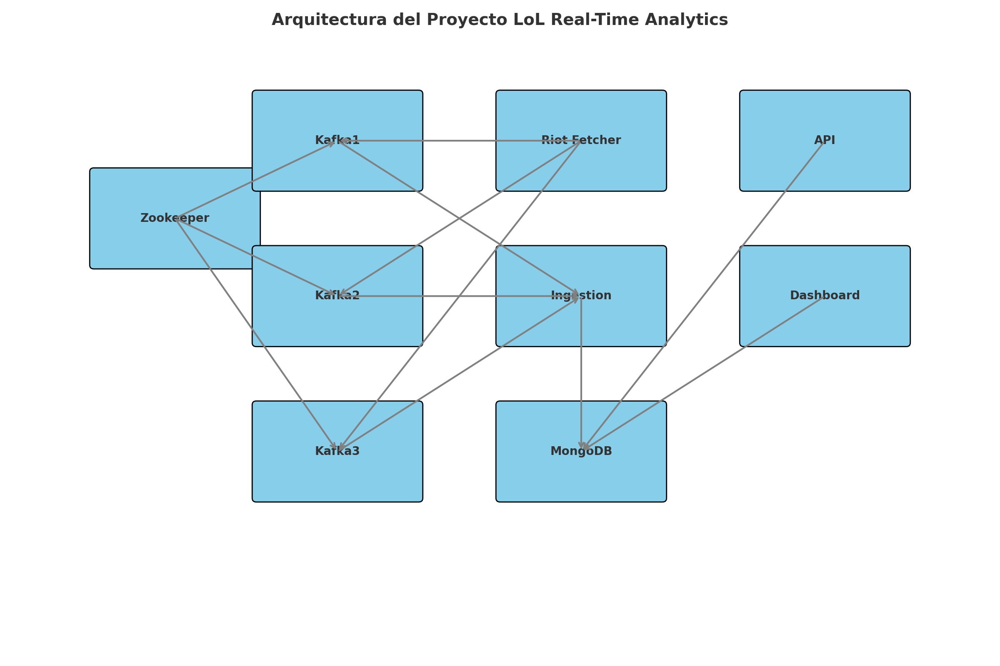

# TFM - Análisis en Tiempo Real de Partidas de League of Legends

Este proyecto implementa un sistema de **analítica en tiempo real** para League of Legends (LoL) usando:
- **Apache Kafka** para la ingestión de datos
- **MongoDB** para el almacenamiento
- **Docker Compose** para orquestación de servicios
- **Streamlit** (opcional) para visualización en dashboard

---

## 🧱 Arquitectura



**Flujo:** Riot API → Kafka → Consumers → MongoDB → Dashboard

**Servicios (Docker Compose):**
- `final-riot-fetcher` – productor que obtiene `match_id` desde Riot API y los publica en Kafka
- `final-kafka` – broker Kafka
- `final-kafka-consumer` – consumer que guarda `match_id` en Mongo
- `final-mongo` – base de datos
- *(opcional)* `dashboard` – Streamlit

---

## 🚀 Tecnologías utilizadas

| Tecnología    | Uso                               |
|---------------|-----------------------------------|
| **Docker**    | Contenedorización y orquestación  |
| **Kafka**     | Streaming de datos                |
| **MongoDB**   | Base de datos NoSQL               |
| **Python**    | Servicios backend y procesadores  |
| **Streamlit** | Dashboard interactivo             |
| **FastAPI**   | (opcional) API REST               |


## 📁 Estructura
```plaintext
├── app/
│ ├── api/ # Servicio FastAPI
│ ├── dashboard/ # Dashboard en Streamlit
│ ├── ingestion/ # Procesamiento de datos
│ └── riot_fetcher/ # Conexión con la API de Riot Games
├── data/ # Datos persistentes (MongoDB, Kafka)
├── connect
├── output
├── src/
│ ├── api/ 
│ ├── dashboard/ 
│ └── services/
│     ├── ingestion/ 
      ├── processing/
│     └── riot_fetcher/
├── .env 
├── docs/ # Diagramas y documentación
├── init-topics.sh # Script para inicializar tópicos Kafka
├── docker-compose.yml # Orquestación de contenedores
├── Makefile # Comandos simplificados para levantar el entorno
└── README.md # Este archivo
```

## 🚀 Puesta en marcha

### 1️⃣ Clonar repositorio
```bash
git clone <URL_REPOSITORIO>
cd FINAL
```

### 2️⃣ Levantar infraestructura
```bash
docker compose up -d --build
```

Esto levanta:
- **Kafka**
- **MongoDB**
- **Riot Fetcher** (productor de Kafka)
- **Kafka Consumer**
- **(opcional) Streamlit Dashboard**

### 3️⃣ Consultar Mongo
```bash
docker compose exec final-mongo mongosh --quiet "mongodb://final-mongo:27017/lol" --eval "db.matches.countDocuments()"
docker compose exec final-mongo mongosh "mongodb://final-mongo:27017/lol" --eval "db.matches.findOne()"
```

---

## ✅ Cambios recientes

- Eliminada autenticación en Mongo por defecto (ahora MONGO_URI simple).
- Consumer (matches_service.py):
  - Upsert por match_id (idempotente). 
  - Índice único en match_id. 
  - Manejo de DuplicateKeyError.
- env_config.py y docker-compose.yml alineados con las variables de entorno.

---

## 🔄 Operaciones útiles

- Reemitir matches (el fetcher vuelve a producir):

```bash
docker compose restart final-riot-fetcher
```

- Releer todo el topic desde el principio:

```bash
docker compose stop final-kafka-consumer
docker compose exec final-kafka /opt/bitnami/kafka/bin/kafka-consumer-groups.sh \
  --bootstrap-server final-kafka:9092 \
  --group final-consumer --topic matches \
  --reset-offsets --to-earliest --execute
docker compose up -d final-kafka-consumer
```

---

## 📈 Dashboard con Streamlit (opcional)

```bash
docker compose up -d --build final-dashboard
```

Accede en:
```bash
http://localhost:8501
```

---

## 📌 Próximos pasos
- Worker para descargar el JSON completo de cada partida (match.by_id) y guardarlo en matches_full. 
- Añadir volumen a Mongo para persistir datos entre reinicios. 
- Construir un dashboard o API FastAPI para consultar estadísticas.
---

## Autor
Proyecto desarrollado por Laura Solé como parte del Trabajo Fin de Máster, UCM.
